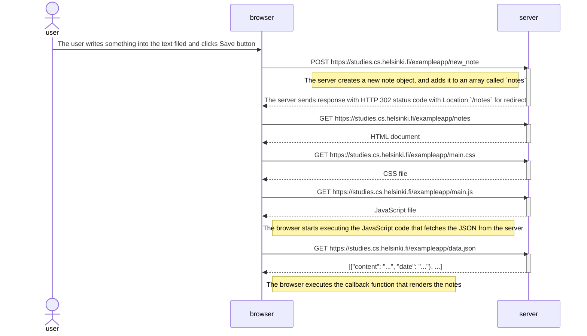

```mermaid
sequenceDiagram
    actor user
    participant browser
    participant server

    user->>browser: The user writes something into the text filed and clicks Save button

    browser->>server: POST https://studies.cs.helsinki.fi/exampleapp/new_note
    activate server
    Note left of server: The server creates a new note object, and adds it to an array called `notes`
    server-->>browser: The server sends response with HTTP 302 status code with Location `/notes` for redirect
    deactivate server

    browser->>server: GET https://studies.cs.helsinki.fi/exampleapp/notes
    activate server
    server-->>browser: HTML document
    deactivate server

    browser->>server: GET https://studies.cs.helsinki.fi/exampleapp/main.css
    activate server
    server-->>browser: CSS file
    deactivate server
    
    browser->>server: GET https://studies.cs.helsinki.fi/exampleapp/main.js
    activate server
    server-->>browser: JavaScript file
    deactivate server

    Note right of browser: The browser starts executing the JavaScript code that fetches the JSON from the server
    
    browser->>server: GET https://studies.cs.helsinki.fi/exampleapp/data.json
    activate server
    server-->>browser: [{"content": "...", "date": "..."}, ...]
    deactivate server

    Note right of browser: The browser executes the callback function that renders the notes
```
