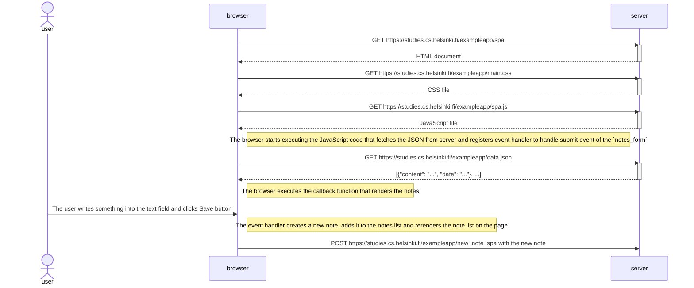

```mermaid
sequenceDiagram
    actor user
    participant browser
    participant server

    browser->>server: GET https://studies.cs.helsinki.fi/exampleapp/spa
    activate server
    server-->>browser: HTML document
    deactivate server

    browser->>server: GET https://studies.cs.helsinki.fi/exampleapp/main.css
    activate server
    server-->>browser: CSS file
    deactivate server

    browser->>server: GET https://studies.cs.helsinki.fi/exampleapp/spa.js
    activate server
    server-->>browser: JavaScript file
    deactivate server

    Note right of browser: The browser starts executing the JavaScript code that fetches the JSON from server and registers event handler to handle submit event of the `notes_form`

    browser->>server: GET https://studies.cs.helsinki.fi/exampleapp/data.json
    activate server
    server-->>browser: [{"content": "...", "date": "..."}, ...]
    deactivate server

    Note right of browser: The browser executes the callback function that renders the notes

    user->>browser: The user writes something into the text field and clicks Save button

    Note right of browser: The event handler creates a new note, adds it to the notes list and rerenders the note list on the page

    browser->>server: POST https://studies.cs.helsinki.fi/exampleapp/new_note_spa with the new note

```